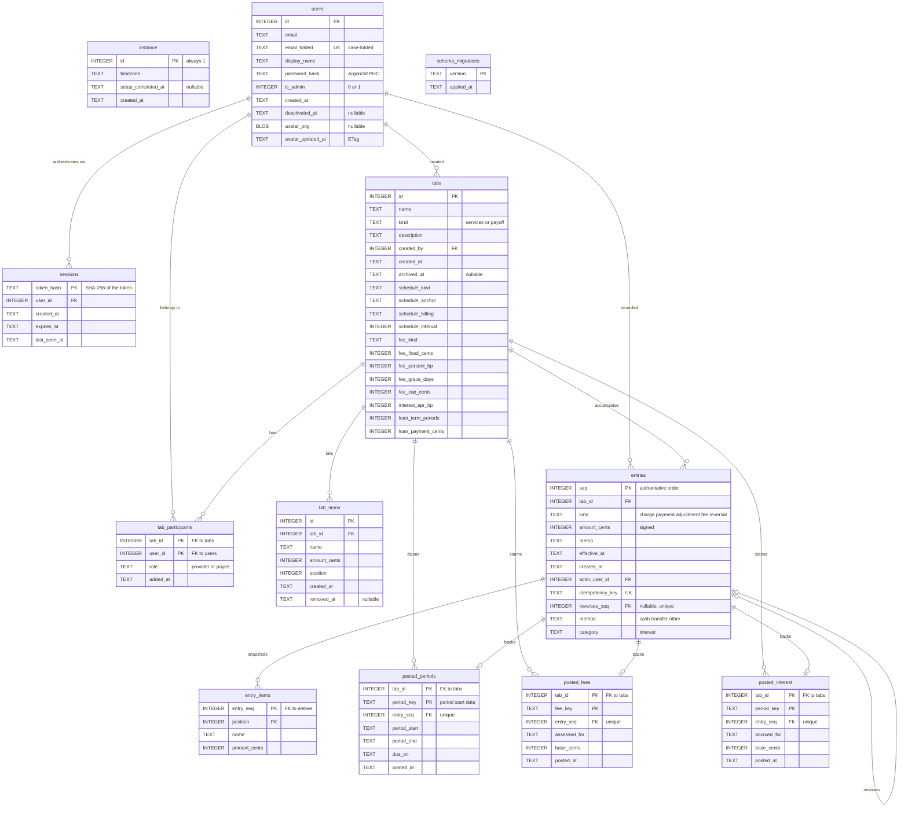

# BitTabby — Physical Data Model and Data Dictionary

The physical schema as SQLite actually holds it, plus the rules that govern each
field. Generated from a migrated database at schema version `0007_profiles`
and checked against `internal/store/sqlite/migrations/`.

This describes **what is stored**. For why the application is shaped this way,
see [PROJECT.md](PROJECT.md); for the invariants the code enforces above the
database, see [planning/HANDOFF.md](planning/HANDOFF.md).

**Portability note.** Every statement lives behind the interfaces in
`internal/store`, and MariaDB is a planned second backend (DEPLOY-02). That is
why there are no SQLite-only types here, no `AUTOINCREMENT` outside surrogate
keys, and why "no schedule" is an empty string rather than `NULL` — comparisons
then need no `COALESCE` on either backend.

---

## 1. Entity-relationship diagram

### Reading the diagram

Three groups, and the distinction matters more than the arrows:

- **Configuration** — `instance`, `users`, `sessions`, `tabs`,
  `tab_participants`, `tab_items`. Mutable. Editing these changes what happens
  next and never what already happened.
- **The ledger** — `entries` and `entry_items`. **Append-only, enforced by
  database triggers.** Nothing updates or deletes a row here, ever.
- **Accrual claims** — `posted_periods`, `posted_fees`, `posted_interest`. Also
  append-only. Each is a `(tab, key)` primary key that makes one automatic
  posting happen exactly once, however many readers race.

---

## 2. Conventions that apply everywhere

| Convention | Rule |
|---|---|
| **Money** | Always `INTEGER` cents. No `REAL`, `FLOAT`, or `DECIMAL` column exists anywhere, and no code path converts through one. |
| **Rates** | Basis points in `INTEGER` (100 bp = 1%), for the same reason. |
| **Timestamps** | `TEXT`, ISO-8601 UTC (`2026-07-23T14:05:00Z`). Sorts lexicographically, which is why it is safe to `ORDER BY` them. |
| **Calendar dates** | `TEXT`, bare `YYYY-MM-DD`, no zone. A period boundary is a *date* in the instance timezone; storing an instant would let it shift a day. |
| **"Unset"** | Empty string, not `NULL`, for enum-like text columns. `NULL` is reserved for "this event has not happened" (`archived_at`, `removed_at`, `deactivated_at`, `setup_completed_at`, `reverses_seq`). |
| **Booleans** | `INTEGER` 0/1 with a `CHECK`. |
| **No derived storage** | There is no balance column, anywhere. Balances are `SUM(amount_cents)`. A test introspects the schema to keep it that way. |

---

## 3. Data dictionary

### 3.1 `instance` — deployment-wide settings

Exactly one row, enforced by `CHECK (id = 1)`.

| Column | Type | Null | Rules and meaning |
|---|---|---|---|
| `id` | INTEGER | no | Always `1`. The `CHECK` is what makes this a singleton rather than a convention. |
| `timezone` | TEXT | no | IANA name, default `UTC`. **Every period boundary and due date is evaluated in this zone.** The binary embeds `time/tzdata` so a scratch container can still resolve it. |
| `setup_completed_at` | TEXT | yes | `NULL` until first-run setup succeeds. Once set it never returns to `NULL`; that is what closes the setup screen permanently (AUTH-03). |
| `created_at` | TEXT | no | When the instance was initialised. |

### 3.2 `users` — accounts

| Column | Type | Null | Rules and meaning |
|---|---|---|---|
| `id` | INTEGER | no | Surrogate PK. |
| `email` | TEXT | no | As the user typed it, preserved for display. |
| `email_folded` | TEXT | no | Case-folded form, **UNIQUE**. Uniqueness is on this, not on `email`, so `Sam@x.com` and `sam@x.com` cannot both exist. |
| `display_name` | TEXT | no | Shown throughout the interface. |
| `password_hash` | TEXT | no | Full Argon2id PHC string, salt included. Never a bare digest, never reversible. |
| `is_admin` | INTEGER | no | 0/1. Instance-wide role, distinct from a per-tab role. **Deactivating the last active admin is blocked inside the write transaction**, not in the handler — a check-then-act above the transaction lets two concurrent requests lock everyone out. |
| `created_at` | TEXT | no | |
| `deactivated_at` | TEXT | yes | `NULL` means active. Deactivation is soft: the account stops authenticating but its ledger entries keep their author. Accounts are never deleted, because `entries.actor_user_id` must stay resolvable forever. |
| `avatar_png` | BLOB | yes | The account's picture, or `NULL`. **Always PNG produced by `internal/avatar`, never the uploaded bytes** — the upload is decoded, cropped square, downscaled, and re-encoded, which strips EXIF/GPS, discards trailing data, and stops a file crafted to parse as two formats. Stored in the database rather than on disk so the deployment stays one binary and one file (DEPLOY-04), which also keeps backup/restore (DEPLOY-06) a single-file promise. **Deliberately excluded from `userColumns`**: a user row is read on every authenticated request and dragging an image through that path would be a steady, pointless cost. |
| `avatar_updated_at` | TEXT | no | When the picture last changed, `''` for none. Serves as the ETag on the avatar route and as the `?v=` cache-buster in markup, so a changed picture appears at once instead of after the max-age. It is also the sole source of `User.HasAvatar()`, which is why it is cleared in the same statement as the blob. |

> **Hazard.** `GetSession` joins `users` with its own hand-written column list
> rather than reusing `userColumns`, because the join needs a `u.` qualifier.
> Any column added to `User` must be added there as well. The authenticated user
> on every request comes from that query, so a column missed there is silently
> zero everywhere in the interface while every direct `GetUser` looks correct.
> This is exactly how the avatar first failed to appear in the header.

### 3.3 `sessions` — server-side login records

| Column | Type | Null | Rules and meaning |
|---|---|---|---|
| `token_hash` | TEXT | no | PK. **SHA-256 of the session token; the raw token is never stored.** A database read cannot be replayed as a login. |
| `user_id` | INTEGER | no | FK → `users.id`, `ON DELETE CASCADE`. |
| `created_at` | TEXT | no | |
| `expires_at` | TEXT | no | Absolute expiry. Sessions **fail closed**: an unparseable or missing row is treated as unauthenticated. |
| `last_seen_at` | TEXT | no | Supports idle timeout and lets an admin see live sessions. |

### 3.4 `tabs` — the shared account between two or more people

The one mutable table with real business rules on it.

| Column | Type | Null | Rules and meaning |
|---|---|---|---|
| `id` | INTEGER | no | Surrogate PK. **Never enumerable by an outsider**: a foreign tab answers 404, not 403. |
| `name` | TEXT | no | |
| `kind` | TEXT | no | `CHECK IN ('services','payoff')`. Drives everything below it. Changing kind changes presentation and measurement, never what has already been charged. |
| `description` | TEXT | no | Default `''`. |
| `created_by` | INTEGER | no | FK → `users.id`. Provenance only; authority comes from `tab_participants`. |
| `created_at` | TEXT | no | Also a floor for catch-up: cycles that came due before the tab existed are not billed. |
| `archived_at` | TEXT | yes | `NULL` means active. **Archiving stops accrual**, guarded in `Server.accrueTab`; without that guard archiving would only hide the tab while it kept billing. |

**Schedule columns** (SCHED-01). All four are empty/default when the tab is billed only by hand, which is a legitimate way to run one.

| Column | Type | Null | Rules and meaning |
|---|---|---|---|
| `schedule_kind` | TEXT | no | `''`, `weekly`, `monthly_day`, `monthly_last`. `biweekly` is **retired** — migration 0006 rewrote it to `weekly` with interval 2, which is date-identical (both are anchor + 14n). |
| `schedule_anchor` | TEXT | no | `YYYY-MM-DD`. Period *zero's start*, not merely a start hint. **Every period is computed from the anchor, never chained off its predecessor** — that is what lets a day-31 anchor clamp to Feb 28 and return to Mar 31 (SCHED-02). |
| `schedule_billing` | TEXT | no | `advance` (charge on the period's first day) or `arrears` (on its last). Per-tab because a retainer is owed up front and metered work after the fact. |
| `schedule_interval` | INTEGER | no | Default 1. How many weeks/months one period spans; 1..104. |

**Late-fee columns** (FEE-01/02/06). All zero/empty means the tab charges no late fee.

| Column | Type | Null | Rules and meaning |
|---|---|---|---|
| `fee_kind` | TEXT | no | `''`, `fixed`, or `percent`. |
| `fee_fixed_cents` | INTEGER | no | Used when `fee_kind = 'fixed'`. |
| `fee_percent_bp` | INTEGER | no | Basis points, used when `fee_kind = 'percent'`. **Taken on the overdue period charge, never on a balance containing fees** — fees must not compound (FEE-05). |
| `fee_grace_days` | INTEGER | no | Days after the due date before a fee may be assessed. |
| `fee_cap_cents` | INTEGER | no | 0 means uncapped. |

**Loan columns** (Payoff tabs only; ignored on Services tabs).

| Column | Type | Null | Rules and meaning |
|---|---|---|---|
| `interest_apr_bp` | INTEGER | no | Annual rate in basis points. 0 = an interest-free IOU. **Accrues on outstanding principal only** (see §5). |
| `loan_term_periods` | INTEGER | no | Number of scheduled payments. **0 means open-ended**, which is what a plain IOU is and what every tab created before 0.5.0 is. A term is what makes a suggested payment and a maturity date computable. |
| `loan_payment_cents` | INTEGER | no | The payment expected each period, **as the Provider entered it from the lender's paperwork**. The app computes its own suggestion and reports the difference; it never overwrites this. 0 means no expectation, which suppresses payoff status and late fees. |

> **Rule worth stating twice.** On a Payoff tab the **loan amount is a charge**
> (posted once, as principal) while **`loan_payment_cents` is an expectation**
> that posts nothing. Before 0.5.0 the payment was inferred from `tab_items`,
> which made those two indistinguishable and let a mis-configured loan read as
> already settled. Payoff tabs no longer use `tab_items` at all.

### 3.5 `tab_participants` — who is party to a tab, and as what

| Column | Type | Null | Rules and meaning |
|---|---|---|---|
| `tab_id` | INTEGER | no | PK part, FK → `tabs.id`, cascade. |
| `user_id` | INTEGER | no | PK part, FK → `users.id`, cascade. The composite PK means one row per person per tab. |
| `role` | TEXT | no | `CHECK IN ('provider','payee')`. |
| `added_at` | TEXT | no | |

**Authorization rules.** This table is the authority, and two capabilities are
deliberately *not* the same:

- **`CanManage`** — the tab's own settings (name, kind, schedule, items, people,
  fee, interest, loan terms). Its Provider may; **so may a global
  administrator**, so a tab whose Provider has left can be repaired without
  hand-editing the database. Every such access is logged at WARN.
- **`CanTransact`** — moving money (charges, payments, adjustments, undo).
  **Membership only.** An administrator is not a party to what two other people
  owe each other. This was a real defect during development: `authorizeTab` was
  widened for administrators and the payment handlers stopped there, letting an
  administrator post to a stranger's tab.

### 3.6 `tab_items` — what a Services tab's period charge is made of

| Column | Type | Null | Rules and meaning |
|---|---|---|---|
| `id` | INTEGER | no | Surrogate PK. |
| `tab_id` | INTEGER | no | FK → `tabs.id`, cascade. |
| `name` | TEXT | no | |
| `amount_cents` | INTEGER | no | |
| `position` | INTEGER | no | Display order; also the join key into `entry_items`. |
| `created_at` | TEXT | no | |
| `removed_at` | TEXT | yes | `NULL` means live. |

**Rules.**

- **Items carry no balance.** They describe what a charge covers.
- **Changes supersede rather than overwrite**: an update marks the old row
  `removed_at` and inserts a replacement at the same `position`. That history is
  what lets catch-up bill each past cycle at *that cycle's* prices
  (`ledger.ItemsAsOf`) rather than at today's (CHG-02).
- **Services tabs only** as of 0.5.0. Rows on Payoff tabs are legacy, shown
  read-only, and read by nothing.

### 3.7 `entries` — the ledger

**The authoritative record. Append-only, enforced three ways:** `store.EntryStore`
exposes no update or delete method, the ledger service is the only writer, and
SQLite `BEFORE UPDATE`/`BEFORE DELETE` triggers `RAISE(ABORT)` on this table.

| Column | Type | Null | Rules and meaning |
|---|---|---|---|
| `seq` | INTEGER | no | PK, autoincrement. **Server-assigned monotonic order** — the authoritative sequence, independent of any client clock (LEDGER-06). |
| `tab_id` | INTEGER | no | FK → `tabs.id`. No cascade: a tab with entries is not deletable. |
| `kind` | TEXT | no | `CHECK IN ('charge','payment','adjustment','fee','reversal')`. **This CHECK cannot gain a value without rebuilding the table**, which the migration harness cannot do safely — hence `category` below. |
| `amount_cents` | INTEGER | no | **Signed. Negative increases what the Payee owes; positive reduces it.** Callers pass positive magnitudes to `Charge`/`Payment`; the ledger applies the sign. |
| `memo` | TEXT | no | Free text: what a charge is for, a payment note, an adjustment's **required** reason, a fee waiver's reason. |
| `effective_at` | TEXT | no | When the entry *applies* — may be backdated. Drives period membership and allocation order. |
| `created_at` | TEXT | no | When it was *recorded*. The pair is LEDGER-05: these differ and both matter. |
| `actor_user_id` | INTEGER | no | FK → `users.id`. Who recorded it. Never null, which is why users are deactivated and not deleted. |
| `idempotency_key` | TEXT | no | **UNIQUE.** Every rendered form carries a fresh random key; a replay returns the original entry with `replayed = true` instead of posting again (LEDGER-07). This is what makes a double-tapped button safe. |
| `reverses_seq` | INTEGER | yes | FK → `entries.seq`, **UNIQUE** where present. Points at the entry this one undoes. The unique index is what makes a second undo a constraint violation rather than a double reversal. |
| `method` | TEXT | no | `''`, `cash`, `transfer`, `other`. Payments only — money moves outside BitTabby and this records how (PAY-02). **Adjustments carry `''`**, because nothing moved. |
| `category` | TEXT | no | `''` or `interest`. Sub-types a charge so periodic interest is distinguishable from loan principal without adding a `kind`. |

**Entry kinds and what they mean**

| Kind | Sign | Meaning and rule |
|---|---|---|
| `charge` | negative | Increases what is owed. A Payoff tab's principal is a single charge; a Services tab's period charges are posted by accrual. |
| `charge` + `category='interest'` | negative | Periodic loan interest. Principal is derived as *non-interest* charges. |
| `payment` | positive | The Payee met an obligation. **Allocated interest-first** (U.S. Rule). Counts toward the late-fee window. |
| `adjustment` | **either** | A correction to what is owed, outside the charge path (CHG-03). Requires a reason. Positive = credit, negative = debit. **A credit is allocated principal-first** — see §5. |
| `fee` | negative | A late fee. Owed, but not part of the loan: interest never accrues on it. |
| `reversal` | opposite of its target | Undoes one entry in full. Partial undo does not exist; correct a partial with an `adjustment`. |

### 3.8 `entry_items` — the itemisation frozen into a charge

| Column | Type | Null | Rules and meaning |
|---|---|---|---|
| `entry_seq` | INTEGER | no | PK part, FK → `entries.seq`, cascade. |
| `position` | INTEGER | no | PK part. |
| `name` | TEXT | no | Copied from `tab_items` **at posting time**. |
| `amount_cents` | INTEGER | no | Likewise. |

**Rule.** This is a snapshot, not a reference (CHG-01). Editing a `tab_items`
row must never rewrite what a past charge said it covered. Append-only triggers
protect it exactly as they protect `entries`.

### 3.9 The three claim tables

`posted_periods`, `posted_fees`, `posted_interest` are the same pattern three
times, and **any new accrual type must copy it rather than invent a second one.**

| Table | Key | Claims |
|---|---|---|
| `posted_periods` | `(tab_id, period_key)` | One billing cycle has been charged. `period_key` is the period's **start** date — not its due date — so changing the billing rule cannot re-post a cycle under a new key. |
| `posted_fees` | `(tab_id, fee_key)` | One overdue date has been fined. |
| `posted_interest` | `(tab_id, period_key)` | One period has accrued interest. |

Common columns:

| Column | Type | Rules and meaning |
|---|---|---|
| `entry_seq` | INTEGER | FK → `entries.seq`, **UNIQUE**. One entry backs at most one claim, so a bug that reused a seq surfaces as a constraint violation rather than a tab short a charge. |
| `base_cents` | INTEGER | (fees, interest) The amount the charge was computed on, retained so a percentage fee can be shown to have been taken on the period charge and a declining interest charge on the balance it was really taken on. |
| `posted_at` | TEXT | When the claim was made. |
| dates | TEXT | `period_start` / `period_end` / `due_on` / `assessed_for` / `accrued_for`, denormalised so a statement renders without recomputing period arithmetic, and so a cycle keeps the dates it was *actually* billed under if the schedule later changes (SCHED-05). |

**The concurrency rule, and it is the whole design.** The claim row and its
ledger entry are written **in one transaction**. Two concurrent readers of an
overdue tab both compute the same due periods and both try to post; the loser's
`INSERT` violates the primary key and the rollback takes its duplicate entry
with it. Nothing reads-then-writes, so there is no window to lose. All three
tables also carry append-only triggers: repointing a claim at a different entry,
or deleting one so a cycle could post again, would defeat this as surely as
editing the ledger would.

### 3.10 `schema_migrations`

| Column | Type | Rules |
|---|---|---|
| `version` | TEXT | PK. The migration filename stem, e.g. `0007_profiles`. |
| `applied_at` | TEXT | Migrations are applied in filename order, each inside its own transaction, and recorded here. **Forward-only — there are no down migrations.** |

---

## 4. Invariants

Things that must be true of any BitTabby database. Several have tests that fail
if they stop holding.

1. **A tab's balance is `SUM(entries.amount_cents)` for that tab.** No balance
   column exists; a schema-introspection test keeps it that way. A cache here is
   the single most likely way "the balance is always correct" fails.
2. **No row in `entries` or `entry_items` is ever updated or deleted.** Triggers
   abort the attempt.
3. **`idempotency_key` is globally unique.** Replays return the original entry.
4. **At most one reversal per entry**, by the unique index on `reverses_seq`.
5. **One claim per `(tab, period)`**, and one entry per claim.
6. **Every entry has a resolvable `actor_user_id`** — accounts deactivate, never
   delete.
7. **At least one active administrator exists**, enforced inside the write
   transaction.
8. **Money is only ever integer cents**; no floating-point column or conversion
   exists in the money path.
9. **Archived tabs do not accrue.**
10. **Interest never accrues on a fee, and never on unpaid interest** (§5).
11. **`avatar_png` and `avatar_updated_at` are always consistent** — set together,
    cleared together. A blob with no timestamp would be invisible to
    `HasAvatar()`; a timestamp with no blob would render a broken image.
12. **Stored avatar bytes were produced by this application**, never by an
    uploader.

---

## 5. Loan arithmetic rules

These are conventions borrowed from US consumer lending, so that the figures
here can be checked against a lender's statement. Verified against an issued
amortization schedule: $21,852.48 at 5.24% over 48 monthly payments, quoted at
$505.65 and computed here at $505.63 — the difference is the lender's rounding.

**Simple interest on the declining balance.** Interest is charged on what is
still owed. Precomputed interest (the Rule of 78s) is deliberately not
implemented; it would make early payoff save the borrower nothing.

**The U.S. Rule for allocation.** A **payment** covers accrued interest first
and reduces principal with the remainder. Interest a short payment did not cover
accumulates in its own bucket where it is owed, is repaid before principal, and
**never accrues interest of its own** — unpaid interest is never capitalised.
Regulation Z permits this for closed-end credit and consumer lenders run it. The
practical reason: capitalising it means a borrower who misses a payment and
catches up separates permanently from their bank's figure.

**A credit is allocated principal-first, deliberately unlike a payment.** A
payment is the Payee meeting an obligation, and interest is the oldest part of
what they owe. An `adjustment` credit is the Provider deciding part of the debt
should not exist; applying it to interest would leave the principal that
generated that interest untouched, so the same interest accrues again next
period and the credit quietly funds it. Off principal, the reduction is
permanent and every later accrual is smaller.

**The period rate is an exact fraction of a year**, not APR divided by a
periods-per-year count — that has no answer for an interval like three weeks,
since 52/3 is not an integer.

| Schedule | Basis | Rate per period |
|---|---|---|
| Monthly (interval 1) | 30/360 | APR × 1/12 — exactly the APR/12 a borrower can check by hand |
| Every N months | 30/360 | APR × N/12 |
| Weekly (interval 1) | actual/365 | APR × 7/365 |
| Every N weeks | actual/365 | APR × 7N/365 |

**Rounding is to the cent, once per period, on the interest, before the payment
is split.** That is how a lender's schedule is computed, and rounding elsewhere
drifts over a long term.

**The final payment is smaller.** The suggested payment is the smallest that
retires the loan within its term, so the last one clears whatever remains —
standard practice, and it avoids a stub period after the term ends.

**What the app cannot match.** Many auto lenders accrue *per diem* on
actual/365, where a payment's split depends on the exact number of days since
the last one. A period-based model cannot reproduce that to the cent. This is
why `loan_payment_cents` is entered by the Provider and never overwritten: the
lender's figure is the one that must be paid, and the app reports the difference
rather than pretending it can resolve it.
